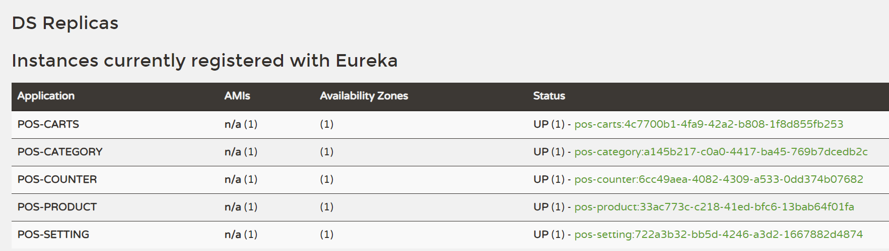
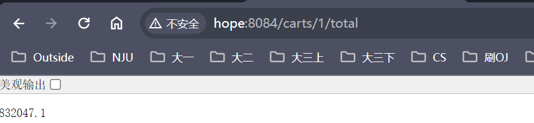

# Micro WebPoS 

## 一、将程序改造为微服务架构

目前主要aw05的中的setting、category、product三个服务分别改为微服务架构，并添加了carts、counter两个微服务，运行时需要依次启动：
- pos-config-server 
  - (配置参考了petlinic，在：https://github.com/JJjjxx/pos-microservices-config.git)
  - 运行在 8888端口
- pos-discovery
  - 运行在 8761端口
- pos-product
- pos-setting 
- pos-category 
- pos-carts
- pos-counter

下图为运行后在：[localhost:8761](http://localhost:8761/) 的情况：

## 二、使用RestTemplate进行服务间访问
在carts的服务中，利用`RestTemplate`，通过HTTP使其能够访问到`pos-counter`提供的`checkout`服务。

设置`COUNTER_URL = "http://POS-COUNTER/counter/"`
，使得RestTemplate发送请求时，可以访问Eureka Dashboard来查看所有注册的服务，例如，此时会查询到POS-COUNTER的地址。

我们访问pos-carts的服务，发现能成功得到结果：

这里得到的结果为上面的`fibonacci+total`的结果。

### 三、加入断路器机制

参考了Spring的指南：`spring-circuitbreaker`项目
我在pos-carts的向pos-counter请求时加入断路器，使得请求超时时，返回默认的-1.

